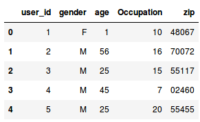
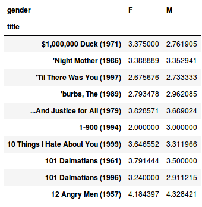
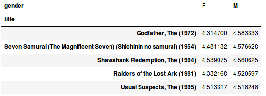
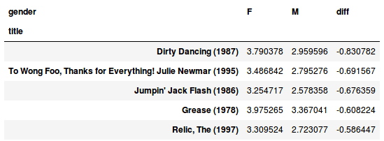

این روزها پایتون یکی از محبوب‌ترین زبان‌ها برای آنالیز دیتا هست و استفاده ازش برای کارهای مرتبط با این حوزه، روزبه‌روز در حال افزایشه. من برای تحلیل و آنالیز دیتاهای مختلف، از کتابخانه pandas پایتون استفاده می‌کنم و در این پست، دیتاست مشهور MovieLens رو بررسی می‌کنم و یک سری آنالیزهای مقدماتی رو روی این دیتاست انجام میدم. برای همراه شدن با این پست، داشتن آشنایی اولیه با پایتون کافیه و من فرض می‌کنم مخاطب این پست با پایتون آشناست؛ پس اگه سوالی داشتید، کامنت بذارید.

[دیتاست MovieLens](https://grouplens.org/datasets/movielens/)، یکی از کارهای تحقیقاتی دانشگاه Minnesota است که شامل امتیازهایی هست که کاربران به فیلم‌های مختلف داده‌اند و تیم تحقیقاتی این دانشگاه، دیتای کامل رو در نسخه‌های مختلف به صورت رایگان منتشر کرده. (شما هم می‌تونین با امتیاز دادن به فیلم‌ها در [سایت MovieLens](http://movielens.org/)، هم به کامل‌تر شدن این دیتاست کمک کنید و هم ریکامندیشن‌های خوبی برای فیلم‌های بعدیتون دریافت کنید.)

من دو دیتاست مختلف این مجموعه رو بررسی می‌کنم. [دیتاست اول (۶ مگ)](http://files.grouplens.org/datasets/movielens/ml-1m.zip)، یکی از نسخه‌های قدیمی این مجموعه، شامل یک میلیون rating هست. این دیتاست رو به این خاطر انتخاب کردم، که برخلاف نسخه‌های جدیدتر، اطلاعات دموگرافیک از کاربران رو هم داخلش داره. فایل‌های این دیتاست رو تو همون دایرکتوری که jupyter notebook رو اجرا کردید extract کنید تا بتونیم فایل‌های dat رو در دیتافریم‌های pandas فراخوانی کنیم:

```python
import pandas as pd

users_columns = ['user_id', 'gender', 'age', 't', 'zip']
df_users = pd.read_table('users.dat', sep='::', header=None, names=users_columns, engine='python')

ratings_columns = ['user_id', 'movie_id', 'rating', 'timestamp']
df_ratings = pd.read_table('ratings.dat', sep='::', header=None, names=ratings_columns, engine='python')

movies_columns = ['movie_id', 'title', 'genres']
df_movies = pd.read_table('movies.dat', sep='::', header=None, names=movies_columns, engine='python')

df_users.head()
```
اگه یکی از فایل‌های dat رو با یه ادیتور متنی باز کنیم، می‌بینیم که اولاً این فایل‌ها هدر ندارن و ثانیاً مقادیر هر ستون با دو تا دو نقطه (::) از هم جدا شدن:

```
a1::Toy Story (1995)::Animation|Children's|Comedy 
a2::Jumanji (1995)::Adventure|Children's|Fantasy 
a3::Grumpier Old Men (1995)::Comedy|Romance 
a4::Waiting to Exhale (1995)::Comedy|Drama 
a5::Father of the Bride Part II (1995)::Comedy
```

فایل README این دیتاست، توضیح داده که هر کدوم از ستون‌های فایل‌های users.dat، movies.dat و ratings.dat مربوط به چه اطلاعاتی هستن و براساس این راهنما، این سه فایل رو در سه دیتافریم pandas (که طبق عادت، با پیشوند df\_ مشخص می‌کنم) فراخوانی می‌کنیم تا بتونیم آنالیزشون بکنیم.

به کمک متد head، ۵ رکورد اول دیتافریم df\_users رو نمایش میدیم تا چک کنیم شامل چه اطلاعاتی هست و آیا درست فراخوانی شده یا نه. این کار رو برای df\_movies و df\_ratings هم می‌تونیم انجام بدیم:



برای اینکه بتونیم از دیتای این سه دیتافریم، در کنار هم استفاده کنیم، نیاز داریم که اون‌ها رو با هم ترکیب کنیم و یه دیتافریم جدید بسازیم:

```python
df_merged = pd.merge(pd.merge(df_ratings, df_users), df_movies) 
df_merged.head()
```


اولین چیزی که توجه من رو جلب می‌کنه، اینه که user\_id = 1، سنش 1 هست و در نگاه اول به نظر میاد که بخشی از دیتامون مشکل داره (یه بچه یک‌ساله می‌تونه راجع به کیفیت فیلم نظر داده باشه؟!) کمترین عدد ستون age تو این دیتافریم چیه؟

```python
df_users.age.min() 
#a1
```

نتیجه رو همون 1 برمی‌گردونه (خوبیش اینه که صفر نداریم!). تو این دیتافریم چندتا یوزر داریم که سنشون 1 باشه؟ و این یوزرها، چند درصد از کل دیتا هستند؟

```python
df_users[df_users.age == 1].user_id.count() 
#a222 

df_users[df_users.age == 1].user_id.count() / df_users.user_id.count() 
#a0.036754966887417216
```

به کمک دو خط کد بالا، متوجه میشیم که ۲۲۲ یوزر با سن 1 توی دیتامون داریم که ۳.۷ درصد از کل دیتا هستند. به نظر میاد مشکل سورس دیتامون باشه که برای این یوزرها، سن واقعیشون رو نداشتند و از عدد 1 براشون استفاده کرده‌اند. منم این تصور رو داشتم و می‌خواستم با این فرض به آنالیز ادامه بدم، ولی وقتی با دقت بیشتری فایل README رو خوندم، توضیحات زیر رو راجع به سن یوزرها دیدم:

```
- Age is chosen from the following ranges:

*a1: "Under 18" 
*a18: "18-24" 
*a25: "25-34" 
*a35: "35-44" 
*a45: "45-49" 
*a50: "50-55" 
*a56: "56+"
```

بدون اینکه توضیحاتی که از سمت ارائه‌دهنده دیتا بهمون رسیده، با فرضیات خودمون می‌خواستیم آنالیز رو انجام بدیم، که کار اشتباهی هست و بعضی وقت‌ها ممکنه کلاً به نتیجه‌گیری اشتباه هم منجر بشه (اگه تو شرکت، دیتا رو از منابع مختلف به دست میارید، با ownerهای اون دیتا راجع به جزئیاتش صحبت کنید و مطمئن بشید که برداشتتون یکسان هست، و با فرضیات غلط خودتون پیش نمی‌رید).

بیاید مطمئن شیم که طبق متن راهنما، ستون age فقط شامل اعداد 1، 18، 25، 35، 45، 50 و 56 هست:

```python
df_users.age.unique() 
# array([ 1, 56, 25, 45, 50, 35, 18])
```

بله درسته. پس کدهای زیر رو هم اضافه کردیم:

```python
df_merged = pd.merge(pd.merge(df_ratings, df_users), df_movies)

df_users.age.min()
# 1

df_users[df_users.age == 1].user_id.count()
# 222

df_users[df_users.age == 1].user_id.count() / df_users.user_id.count()
# 0.036754966887417216

df_users.age.unique()
# array([ 1, 56, 25, 45, 50, 35, 18])
```
شاید با pivot tableهای اکسل آشنا باشید. می‌خوایم دیتافریم df\_merged رو به شکل pivot table نمایش بدیم و میانگین امتیاز هر فیلم، که توسط خانم‌ها و آقایون داده شده رو در دو ستون مختلف ببینیم:

```python
df_mean_ratings = df_merged.pivot_table('rating', index='title', columns='gender', aggfunc='mean') 
df_mean_ratings.head(10)
```



یه نکته‌ای که باید در نظر بگیریم اینه که فیلم‌های زیادی در این دیتاست هستند که افراد کمی بهشون امتیاز دادن (این قضیه رو در دیتاست دوم مفصل‌تر بررسی می‌کنیم) و مثلاً به یک فیلم، دو نفر و هر دو ۵ امتیاز دادن، در نتیجه میانگین امتیاز اون فیلم، ۵ ثبت شده؛ در حالی که یه فیلم خیلی خوب، از ۶۰هزار نفر امتیاز گرفته و میانگین امتیازش ۴.۹ شده (طبیعتاً همه ۶۰هزار نفر، سلیقه یکسانی ندارند). پس اگه می‌خوایم فیلم‌های برتر رو بررسی کنیم، بهتره اون‌هایی که تعداد امتیازدهنده کمی دارند رو از دیتافریم فیلتر کنیم:

```python
ratings_by_title = df_merged.groupby('title').size() 
active_titles = ratings_by_title.index[ratings_by_title >= 200] 
df_mean_ratings = df_mean_ratings.loc[active_titles] 
df_mean_ratings.head(10)
```

 

فیلم‌هایی که کمتر از ۲۰۰ امتیازدهنده داشتند رو حذف کردیم؛ می‌بینیم که مواردی مثل Night Mother و Til There Was You در دیتافریم جدید، وجود ندارند (امتیازدهنده کمی داشتند). ببینیم خانم‌ها از چه فیلم‌هایی بیشتر خوششون اومده:

```python
top_female_ratings = mean_ratings.sort_values(by='F', ascending=False) 
top_female_ratings.head()
```


آقایون چطور؟

```python
top_male_ratings = df_mean_ratings.sort_values(by='M', ascending=False) 
top_male_ratings.head()
```



خب بیاید یه ستون دیگه به دیتافریم جدیدمون اضافه کنیم و اختلاف امتیاز خانم‌ها و آقایون به هر فیلم رو بسنجیم:

```python
df_mean_ratings['diff'] = df_mean_ratings['M'] - df_mean_ratings['F'] 
df_mean_ratings.head()
```


کدوم فیلم‌ها رو خانم‌ها خیلی بیشتر از آقایون پسندیدن؟

```python
sorted_by_diff = df_mean_ratings.sort_values(by='diff') 
sorted_by_diff.head()
```



و برعکس، کدوم فیلم‌ها، امتیاز بالایی از آقایون گرفتن ولی خانم‌ها امتیاز کمی بهشون دادن؟

```python
sorted_by_diff[::-1].head()
```


و یه بررسی نسبتاً جالب‌تر؛ کاربرها (مستقل از جنسیت) درباره چه فیلم‌هایی بیشترین اختلاف نظر رو داشته‌اند؟ در واقع standard deviation امتیازهای کاربرها به هر فیلم، چقدر بوده و کدوم فیلم‌ها بالاترین مقدار رو داشته‌اند؟

```python
rating_std_by_title = df_merged.groupby('title')['rating'].std() 
rating_std_by_title = rating_std_by_title.loc[active_titles] 
rating_std_by_title.sort_values(ascending=False).head(10)
```

```
# title 
# Plan 9 from Outer Space (1958) 1.455998 
# Texas Chainsaw Massacre, The (1974) 1.332448 
# Dumb & Dumber (1994) 1.321333 
# Blair Witch Project, The (1999) 1.316368 
# Natural Born Killers (1994) 1.307198 
# Idle Hands (1999) 1.298439 
# Transformers: The Movie, The (1986) 1.292917 
# Very Bad Things (1998) 1.280074 
# Tank Girl (1995) 1.277695 
# Hellraiser: Bloodline (1996) 1.271939
```

پس کدهای زیر هم به قبلی‌ها اضافه شدند:

```python
df_mean_ratings = df_merged.pivot_table('rating', index='title', columns='gender', aggfunc='mean')

ratings_by_title = df_merged.groupby('title').size()
active_titles = ratings_by_title.index[ratings_by_title >= 200]
df_mean_ratings = df_mean_ratings.loc[active_titles]

top_female_ratings = df_mean_ratings.sort_values(by='F', ascending=False)

top_male_ratings = df_mean_ratings.sort_values(by='M', ascending=False)

df_mean_ratings['diff'] = df_mean_ratings['M'] - df_mean_ratings['F']

sorted_by_diff = df_mean_ratings.sort_values(by='diff')

sorted_by_diff[::-1].head()

rating_std_by_title = df_merged.groupby('title')['rating'].std()
rating_std_by_title = rating_std_by_title.loc[active_titles]
rating_std_by_title.sort_values(ascending=False).head(10)

# title
# Plan 9 from Outer Space (1958)         1.455998
# Texas Chainsaw Massacre, The (1974)    1.332448
# Dumb & Dumber (1994)                   1.321333
# Blair Witch Project, The (1999)        1.316368
# Natural Born Killers (1994)            1.307198
# Idle Hands (1999)                      1.298439
# Transformers: The Movie, The (1986)    1.292917
# Very Bad Things (1998)                 1.280074
# Tank Girl (1995)                       1.277695
# Hellraiser: Bloodline (1996)           1.271939
# Name: rating, dtype: float64
```
**نکات:**

\- [فایل jupyter notebook](https://github.com/saeedesmaili/datanerd/blob/master/movielens/movieLens-1.ipynb) مربوط به کدهای این پست رو از گیت‌هاب می‌تونید دریافت کنید.

\- یه پست دیگه، برای آنالیز آخرین نسخه این مجموعه (دیتاست شامل ۲۶ میلیون rating و ۲۷۰ هزار یوزر که تا آگوست ۲۰۱۷ آپدیت هست) می‌نویسم. این دیتاست اطلاعات دموگرافیک یوزرها مثل سن و جنسیت رو نداره، ولی از نظر امتیازات فیلم‌ها، مجموعه کامل‌تری هست. اگه بررسی خاصی به ذهنتون می‌رسه که میشه روی این دیتاست انجام داد، بگید تا موقع نوشتن پست بعدی، در نظر بگیرم.

\- خیلی دوست داشتم که میشد آنالیز مشابهی رو روی فیلم‌های ایرانی انجام داد، ولی دیتاست مشابهی که فیلم‌ها و یوزرهای ایرانی رو شامل بشه، نداریم (تو دیتاست MovieLense، معدود فیلم‌های ایرانی حضور دارند و کاربرانی مثل من، به فیلم‌های مختلف امتیاز داده‌اند، ولی منظورم دیتاستی که مختص فیلم‌ها و یوزرهای ایرانی باشه هست). شاید فیلیمو تنها جایی باشه که بتونه دیتاست عمومی از پسندهای کاربران ایرانی رو منتشر کنه. چرا تو ایران، دیتاست‌های این‌چنینی نداریم و علاقه‌ای به انتشارشون هم نشون نمیدیم؟

---


> **پی‌نوشت** (اردیبهشت ۱۴۰۰):
> این پست، قبل از انتقال وبلاگ به سیستم جدید منتشر شده است. کامنت‌هایی که قبل از این انتقال ثبت شده‌اند را این‌جا می‌خوانید:

- **Reza**:  مرسی سعید.
لطفا توی آموزش‌های بعدی از تحلیل‌های آماری مثل واریانس هم استفاده کن. واگر بشه نمودار نرمال برای دیتاها تهیه کن و روی نمودارها هم تحلیل انجام بده.
مرسی

- **شراگیم**:  آنالیز دیتا متاسفانه تو استارت اپهای ایرانی نادیده گرفته میشه

- **امیر**:  سلام. لینکی که برای دیتاست گذاشتید اشتباهه اطلاعات جنسیت و سن کاربرها رو نداره.
فکر کنم دیتاست درست این باشه که ۶مگه و ۱میلیون ریتینگ داره:
http://files.grouplens.org/datasets/movielens/ml-1m.zip

**سعید**:  بله، اصلاحش کردم
ممنون

- **شیدا میرجهانی**:  مثلا میتونیم ببینیم خانوم ها و آقایون از چه ژانرهایی بیشتر خوششون اومده :)

- **سارا**:  مرسی از مقاله خوبتون .

- **محمد حیدری**:  سلام 
جای همچین آموزشی که قدم به قدم به آنالیز دیتا بپردازه با یه دیتاست نسبتا بزرگ خالی بود. کاش میشد از Matplotlib هم برای مصور سازی داده ها واسه هیجان انگیزتر کردن کار استفاده کنی