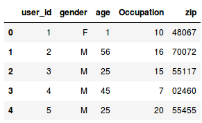
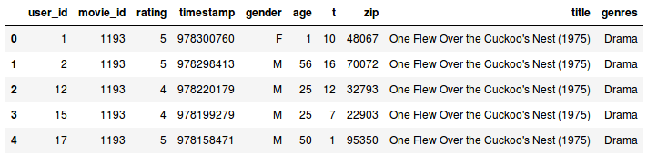
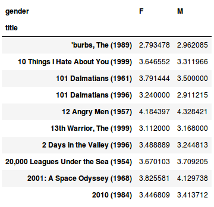
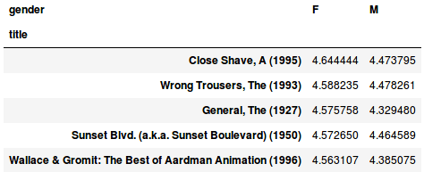
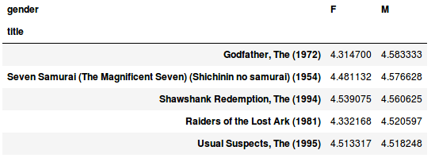
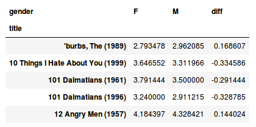
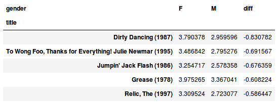
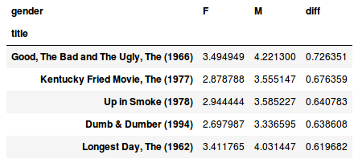

Nowadays Python is the most popular language for analyzing data and analysts are using its tools more than before. I also use its Pandas library for a variety of analyses and in this post, I want to have a look at a popular public dataset, called MovieLens, and do some basic data wrangling on it. Having a basic knowledge of python is enough to understand this post and I assume that you are familiar with python. So let me know if you had any questions.

[MovieLens](https://grouplens.org/datasets/movielens/) is one of the researches of Minnesota University and consists of the ratings that users have given to movies and it's a public dataset. (You can help them to have more ratings by rating the movies on the [MovieLens website](http://movielens.org/). It will recommend you some great movies based on your taste too)

I will analyze two different versions of this dataset. [The first one](http://files.grouplens.org/datasets/movielens/ml-1m.zip) (6MB) is one of the old versions of MovieLens that consists of 1 million ratings. I chose this one because, despite the newer versions, there is some demographic information of users. Extract all files in the same directory that your jupyter notebook file is running, so we can load ".dat" files to pandas easily:

```python
import pandas as pd

users_columns = ['user_id', 'gender', 'age', 't', 'zip']
df_users = pd.read_table('users.dat', sep='::', header=None, names=users_columns, engine='python')

ratings_columns = ['user_id', 'movie_id', 'rating', 'timestamp']
df_ratings = pd.read_table('ratings.dat', sep='::', header=None, names=ratings_columns, engine='python')

movies_columns = ['movie_id', 'title', 'genres']
df_movies = pd.read_table('movies.dat', sep='::', header=None, names=movies_columns, engine='python')

df_users.head()
```
If we open one of the ".dat" files with a text editor, it's obvious that these files lack the header, and values are separated by "::".

```
a1::Toy Story (1995)::Animation|Children's|Comedy 
a2::Jumanji (1995)::Adventure|Children's|Fantasy 
a3::Grumpier Old Men (1995)::Comedy|Romance 
a4::Waiting to Exhale (1995)::Comedy|Drama 
a5::Father of the Bride Part II (1995)::Comedy
```
We can check the README file to understand the type of data that has been stored in every column of *users.dat*, *movies.dat*, and *ratings.dat* files. Using this guidance we load these three files in three pandas dataframe (I'm used to specifying dataframes by *df_* prefix).

We check the first five rows of *df_users* using *the head()* method to be sure our data has been loaded correctly. We can do the same for *df_movies* and *df_ratings* too:



To analyze all three dataframes altogether we need to merge them as a single dataframe:

```python
df_merged = pd.merge(pd.merge(df_ratings, df_users), df_movies) 
df_merged.head()
```



The first point that shines here to me is the first user's age, which equals 1! It seems something in our data is wrong (is it possible that a one-year-old child has given a rating to a movie?!). Let see what's the minimum of values in *the age* column:

```python
df_users.age.min() 
#a1
```

Yup, it's 1 (at least we don't have 0 in the *age*!). How many users do we have that their age equals 1? What percentage of the data are they?

```python
df_users[df_users.age == 1].user_id.count() 
#a222 

df_users[df_users.age == 1].user_id.count() / df_users.user_id.count() 
#a0.036754966887417216
```

Oops! We have 222 one-year-old users, and in other words, 3.7% of our users have one year of age. It seems that there is a problem in the data source and "1" it's been used as a placeholder for null values in the age column. At least this was my first assumption for this issue, but after reading the README of the data source carefully, I found the following explanation for the age column's values:

```
- Age is chosen from the following ranges:

*a1: "Under 18" 
*a18: "18-24" 
*a25: "25-34" 
*a35: "35-44" 
*a45: "45-49" 
*a50: "50-55" 
*a56: "56+"
```

We were going to analyze the data with our own assumptions and without understanding the data itself. That's a big mistake, and most of the time it's really dangerous. As a data analyst, before doing any type of analysis, we have to make sure that we understand the data source really well, and we know what different values in each column mean. If you have access to multiple data sources in your company, you have to discuss the details of each data with its owner (the team of person that is responsible for gathering or cleaning that data source), before making any conclusion about that data or your analysis.

Let's make sure that the age column is consisted of numbers 1, 18, 25, 35, 45, 50, and 56, as described in the documentation:

```python
df_users.age.unique() 
# array([ 1, 56, 25, 45, 50, 35, 18])
```

Yes, it is. So, we also added the following parts to our Python code:

```python
df_merged = pd.merge(pd.merge(df_ratings, df_users), df_movies)

df_users.age.min()
# 1

df_users[df_users.age == 1].user_id.count()
# 222

df_users[df_users.age == 1].user_id.count() / df_users.user_id.count()
# 0.036754966887417216

df_users.age.unique()
# array([ 1, 56, 25, 45, 50, 35, 18])
```
You might be familiar with Excel's pivot table functionality. Here we want to use the pivot table on df_merged data frame, and see in two separated columns the average rating of each movie given by male and female users:

```python
df_mean_ratings = df_merged.pivot_table('rating', index='title', columns='gender', aggfunc='mean') 
df_mean_ratings.head(10)
```


Note that there are lots of movies in this dataset that have been rated just by a few users (We will examine this issue more deeply in the second dataset). For example, there is a movie with only two ratings of 5 (average = 5), and another movie with 60K ratings and an average of 4.9. We can't say that the former is a better movie. So for our goal, it's a good practice to remove the movies that don't have enough ratings to be judged:

```python
ratings_by_title = df_merged.groupby('title').size() 
active_titles = ratings_by_title.index[ratings_by_title >= 200] 
df_mean_ratings = df_mean_ratings.loc[active_titles] 
df_mean_ratings.head(10)
```

 

We removed the records with less than 200 ratings. So movies like `Night Mother` and `Till There Was You` aren't available in the new dataframe. Let's see what movies the female users like more:

```python
top_female_ratings = mean_ratings.sort_values(by='F', ascending=False) 
top_female_ratings.head()
```



What about the male users?

```python
top_male_ratings = df_mean_ratings.sort_values(by='M', ascending=False) 
top_male_ratings.head()
```



Let's add another column to our new dataframe and see what's the difference in the average rating of male and female users for each movie:

```python
df_mean_ratings['diff'] = df_mean_ratings['M'] - df_mean_ratings['F'] 
df_mean_ratings.head()
```



Which movies the female users like more than male users?

```python
sorted_by_diff = df_mean_ratings.sort_values(by='diff') 
sorted_by_diff.head()
```



And vice versa, which movies have received high ratings from male users, but low ratings from female ones?

```python
sorted_by_diff[::-1].head()
```



And the last interesting examination; For which movies the users (independent of gender) have the most disagreement? Disagreement can be measured by the variance or standard deviation of the ratings:

```python
rating_std_by_title = df_merged.groupby('title')['rating'].std() 
rating_std_by_title = rating_std_by_title.loc[active_titles] 
rating_std_by_title.sort_values(ascending=False).head(10)
```

```
# title 
# Plan 9 from Outer Space (1958) 1.455998 
# Texas Chainsaw Massacre, The (1974) 1.332448 
# Dumb & Dumber (1994) 1.321333 
# Blair Witch Project, The (1999) 1.316368 
# Natural Born Killers (1994) 1.307198 
# Idle Hands (1999) 1.298439 
# Transformers: The Movie, The (1986) 1.292917 
# Very Bad Things (1998) 1.280074 
# Tank Girl (1995) 1.277695 
# Hellraiser: Bloodline (1996) 1.271939
```

Therefore, we also added the following parts to our Python code:

```python
df_mean_ratings = df_merged.pivot_table('rating', index='title', columns='gender', aggfunc='mean')

ratings_by_title = df_merged.groupby('title').size()
active_titles = ratings_by_title.index[ratings_by_title >= 200]
df_mean_ratings = df_mean_ratings.loc[active_titles]

top_female_ratings = df_mean_ratings.sort_values(by='F', ascending=False)

top_male_ratings = df_mean_ratings.sort_values(by='M', ascending=False)

df_mean_ratings['diff'] = df_mean_ratings['M'] - df_mean_ratings['F']

sorted_by_diff = df_mean_ratings.sort_values(by='diff')

sorted_by_diff[::-1].head()

rating_std_by_title = df_merged.groupby('title')['rating'].std()
rating_std_by_title = rating_std_by_title.loc[active_titles]
rating_std_by_title.sort_values(ascending=False).head(10)

# title
# Plan 9 from Outer Space (1958)         1.455998
# Texas Chainsaw Massacre, The (1974)    1.332448
# Dumb & Dumber (1994)                   1.321333
# Blair Witch Project, The (1999)        1.316368
# Natural Born Killers (1994)            1.307198
# Idle Hands (1999)                      1.298439
# Transformers: The Movie, The (1986)    1.292917
# Very Bad Things (1998)                 1.280074
# Tank Girl (1995)                       1.277695
# Hellraiser: Bloodline (1996)           1.271939
# Name: rating, dtype: float64
```
**Notes:**

- You can access the codes and the [jupyter notebook file](https://github.com/saeedesmaili/datanerd/blob/master/movielens/movieLens-1.ipynb) on Github.

- I will also write a blog post about analyzing the latest Movilense dataset (containing 26M ratings from 270K users). It doesn't have the demographic data of the users (like age and gender), but it contains much more rating data. To which interesting questions we can answer using that dataset? Let me know what you think.

- I would also like to do some analysis on the Iranian movies, but there isn't any dataset for this purpose (of course there also are some Iranian movies in the Movielense dataset, but I mean complete data of these movies and how Iranians rate them). I wonder why Filimo or Namava don't publish such a dataset of their movies?