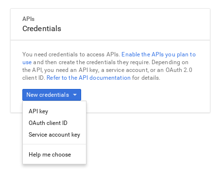

من همیشه ترجیح میدم کارهای تکراری رو خودم انجام ندم و به یه فرد دیگه یا یه اسکریپت پایتون واگذار کنم. مدتی بود که  یه گزارش آنلاین آماده کرده بودم تا همکارانم بتونن وضعیت و روند تغییرات یک‌سری متریک و KPI رو بر روی نمودار ببینن. منبع این گزارش، یه فایل گوگل‌شیت هست که از اون موقع، روزانه به صورت دستی پر می‌شد. برای این‌که دیگه من یا فرد دیگه‌ای این کار تکراری رو انجام نده، یه اسکریپت ساده پایتون نوشتم و روی سرور شرکت گذاشتم تا هر یک ساعت، یه بار داده‌های جدید مربوط به فروش رو به گوگل‌شیت اضافه کنه.

تو این پست، به sql server کوئری می‌زنیم، نتایج رو توی یه دیتافریم pandas ذخیره می‌کنیم و بعد از یه دستکاری کوچیک روی دیتافریم، اون رو روی یه فایل گوگل‌شیت می‌ریزیم.

برای این‌که به sql server وصل بشیم، نیاز به اطلاعاتی مثل آدرس سرور و نام کاربری و رمز عبور داریم که من اون‌ها رو توی یه فایل مجزا وارد می‌کنم:

```python
server = 'your_sql_server_address'
database = 'database_name'
username = 'your_username'
password = 'your_password'
```
این فایل رو با اسم config.py تو همون دایرکتوری که فایل اصلی پایتون پروژه قرار داره، ذخیره می‌کنم و برای استفاده ازش، مثل لایبرری‌های مورد نیاز، ایمپورتش می‌کنم:

```python
import pymssql
import pandas as pd
import config

server = config.server
database = config.database
username = config.username
password = config.password
```
کتابخانه pymssql رو برای اتصال به sql server و pandas رو برای ایجاد dataframe ایمپورت می‌کنیم و مقادیر config رو به عنوان متغیر فراخوانی می‌کنیم. برای اتصال به sql server و کوئری زدن روی دیتابیس، کدهای زیر رو استفاده می‌کنیم:

```python
conn = pymssql.connect(server, username, password, database)
cursor = conn.cursor(as_dict=True)

print("Connected to sql server")

cursor.execute("""
    SELECT
        CONVERT(DATE, orders.date) AS date,
        SUM(CASE WHEN (orders.application = 1) THEN 1 ELSE 0 END) AS website,
        SUM(CASE WHEN (orders.application = 2) THEN 1 ELSE 0 END) AS application,
        SUM(CASE WHEN (orders.application > 0) THEN 1 ELSE 0 END) AS total
    FROM
        orders
    where year(orders.date) > 2017 AND orders.status = 1 -- get only successfull orders of 2018
    GROUP BY
        CONVERT(DATE, orders.date)
    """)
```
این کوئری sql، یه pivot table بهمون میده و تعداد فروش روزانه وب‌سایت، اپلیکیشن و مجموع فروش رو در هر ردیف قرار میده. برای اینکه بتونیم از این دیتا استفاده کنیم، نیاز داریم که اون رو در یه دیتافریم pandas ذخیره کنیم:

```python
df = pd.DataFrame(columns=['date', 'website', 'application', 'total'])

for row in cursor:
    df = df.append(row, ignore_index=True)

conn.close()

print("Data loaded to pandas DataFrame")

df.sort_values(by = 'date', inplace=True)
```
خب الان دیتامون آماده است و اگه بخوایم، تغییرات مورد نظر رو به راحتی با pandas روش انجام میدیم. تو این مورد، من دیتا رو به همین صورت می‌خوام ذخیره کنم. برای ذخیره دیتا روی گوگل‌شیت، باید فایل json مربوط به اعتبارسنجی گوگل رو دریافت کنیم تا اسکریپتمون این اجازه رو داشته باشه که به گوگل‌شیت دسترسی داشته باشه و تغییرات مورد نظر رو روش اعمال بکنه. برای این‌کار، به [Google Developers Console](https://console.developers.google.com/project) میریم و از قسمت Credentials، یه Service Account Key ایجاد می‌کنیم:



با این کار، یه فایل json رو دانلود می‌کنیم که حاوی اطلاعات اعتبارسنجی هست و یکی از موارد داخل فایل، client\_email هست. مقدار مربوط به اون رو کپی می‌کنیم و فایل گوگل‌شیتی که می‌خوایم دیتا رو روی اون بریزیم رو با این ایمیل به اشتراک می‌ذاریم (دقت کنید که دسترسی کامل بهش بدید). بعد از این کار، کتابخانه gspread رو ایمپورت می‌کنیم و به فایل گوگل‌شیت مورد نظرم وصل میشیم:

```python
import gspread
from oauth2client.service_account import ServiceAccountCredentials

scope = ['https://spreadsheets.google.com/feeds']

credentials = ServiceAccountCredentials.from_json_keyfile_name('your_json_file.json', scope)

gc = gspread.authorize(credentials)

wks = gc.open("Your Google Sheet Name").worksheet('Sheet Name')

print("Google sheet is ready now")
```
با کدی که نوشتیم، شیت مورد نظرمون رو با پایتون فراخوانی کردیم و آماده نوشتن دیتا هست:

```python
from gspread_dataframe import set_with_dataframe

set_with_dataframe(wks, df)

print("Data added to sheet successfully")
```
الان تنها کاری که مونده، اینه که همه فرایند رو به عنوان یه فانکشن بنویسیم و با کتابخانه schedule، بهش بگیم هر ساعت یک بار این فرایند رو تکرار کنه:

```python
import pymssql
import pandas as pd
import gspread
import config
from oauth2client.service_account import ServiceAccountCredentials
from gspread_dataframe import set_with_dataframe


server = config.server
database = config.database
username = config.username
password = config.password

def update_sheet():
  conn = pymssql.connect(server, username, password, database)
  cursor = conn.cursor(as_dict=True)
  print("Connected to sql server")

  cursor.execute("""
      SELECT
          CONVERT(DATE, orders.date) AS date,
          SUM(CASE WHEN (orders.application = 1) THEN 1 ELSE 0 END) AS website,
          SUM(CASE WHEN (orders.application = 2) THEN 1 ELSE 0 END) AS application,
          SUM(CASE WHEN (orders.application > 0) THEN 1 ELSE 0 END) AS total
      FROM
          orders
      where year(orders.date) > 2017 AND orders.status = 1 -- get only successfull orders of 2018
      GROUP BY
          CONVERT(DATE, orders.date)
      """)
  
  df = pd.DataFrame(columns=['date', 'website', 'application', 'total'])

  for row in cursor:
      df = df.append(row, ignore_index=True)

  conn.close()
  print("Data loaded to pandas DataFrame")

  df.sort_values(by = 'date', inplace=True)
  
  scope = ['https://spreadsheets.google.com/feeds']

  credentials = ServiceAccountCredentials.from_json_keyfile_name('your_json_file.json', scope)

  gc = gspread.authorize(credentials)

  wks = gc.open("Your Google Sheet Name").worksheet('Sheet Name')
  print("Google sheet is ready now")
  
  set_with_dataframe(wks, df)
  print("Data added to sheet successfully")

import schedule
import time

schedule.every().hour.do(update_sheet)

while True:
  schedule.run_pending()
  time.sleep(60)
```

خب اسکریپتمون آماده است. این فایل رو (با اسم update.py) به همراه فایل config روی سرور آپلود می‌کنیم و با دستور nohup، اون رو فعال نگه‌میداریم تا اگه ترمینال رو بستیم و از سرور خارج شدیم، همچنان بتونه هر ساعت یک بار این فرایند رو تکرار کنه:

```bash
nohup python3 update.py
```

نکات:

\- اگه هر کدوم از کتابخونه‌ها رو نصب ندارید، با دستور `pip3 install` می‌تونید نصبشون کنید.

\- شاید درستش این بود که هر ساعت یه بار که فرایند رو تکرار می‌کنیم، دوباره کل دیتا رو از اول نگیریم و فقط اون مقداری که تغییر کرده و یا روز آخر رو بگیریم. ولی حداقل برای موردی که من استفاده می‌کنم، دیتای روزهای قبل هم مکرراً تغییر می‌کنه و لازمه که اون‌ها هم آپدیت بشن.


---


> **پی‌نوشت** (اردیبهشت ۱۴۰۰):
> این پست، قبل از انتقال وبلاگ به سیستم جدید منتشر شده است. کامنت‌هایی که قبل از این انتقال ثبت شده‌اند را این‌جا می‌خوانید:

- **شیدا میرجهانی**:  خیلی خوب بود متن‌تون.
منم یه بار با یه اسکریپت R برعکس اینکارو کردم:دی 
یعنی توی پاور بی آی، اسکریپ و گذاشتم که هر دفعه که ریفرش میشد اطلاعات یه گوگل شیت و میخوند و نمودارها رو اپدیت میکرد

**سعید**:  کلا این نوع خودکارسازی‌ها خیلی مفیدن و هر جا بتونم، حتما فرایند‌های دستی رو اتومات میکنم و لذت‌بخش هم هست :)

- **امین حسینی**:  سلام سعید عزیز.وقتت بخیر.سعید جان ایمیل زدم براتون یه کم سوال داشتم.اگه وقت کنی و جواب بدی خیلی خوشحال میشم.ممنون ازت.

**سعید**:  جواب دادم به ایمیلت امین جان