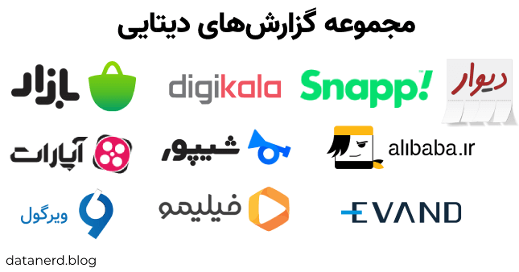

بیزینس‌های ایرانی، از کافه‌بازار و دیوار و دیجی‌کالا تا اسنپ و علی‌بابا و حتی شرکت‌های کوچک‌تر هر سال گزارش‌های دیتایی از عملکرد خودشون و کاربرهاشون منتشر می‌کنن. مجموعه همه این گزارش‌ها رو یک‌جا گردآوری می‌کنم تا دسترسی بهشون راحت‌تر باشه.

هدف اول از این گردآوری اینه که هر زمان که نیاز داشتیم، دسترسی راحتی به همه گزارش‌های دیتایی منتشر شده در ایران داشته باشیم، و دوم این‌که اگه هر کدوم از این گزارش‌ها از سایت اون شرکت حذف شد یا در دسترس نبود، ما بتونیم همچنان بهشون دسترسی داشته باشیم. همین الان هم توی لیست این صفحه می‌بینید که بعضی گزارش‌ها رو من نتونستم روی سایت شرکت‌ها پیدا کنم و اگه شما فایلی از گزارش دیتایی داشتید که توی این لیست نیومده، می‌تونید به من [بفرستید](/contact/) یا به [ریپوی این پروژه روی گیت‌هاب](https://github.com/saeedesmaili/iranian-businesses-data-reports) اضافه کنید.

این صفحه با اضافه شدن گزارش‌های دیتایی جدید، آپدیت خواهد شد. 

**آخرین آپدیت‌ها:**

۱۰ تیر ۱۴۰۰: گزارش ۱۴۰۰ ایران‌اچ‌آر، گزارش‌های نیم‌سال اول ۱۳۹۹ و کل ۱۳۹۹ فرادرس، و شانزده گزارش از سال ۱۳۹۲ تا ۱۳۹۹ ایران‌تلنت اضافه شدند.

۷ خرداد ۱۴۰۰: گزارش شرکت‌های دانش‌بنیان ۱۳۹۲ تا ۱۳۹۸ ارزش‌آفرین اعتماد، مدیا اد ۱۳۹۸، بهار ۱۳۹۸ و نیم‌سال اول ۱۳۹۸ متریکس، تپسل ۱۳۹۸، گزارش سهم بازار شبکه‌های تبلیغاتی و گزارش پلتفرم‌های موبایل‌مارکتینگ ۱۳۹۸ تردنیکس، گزارش‌های سالانه ۱۳۹۸ و ۱۳۹۹ باگ‌دشت، و گزارش وضعیت اینترنت ایران ۱۳۹۹ ابر دراک اضافه شدند.

۲۶ اردیبهشت ۱۴۰۰: گزارش ۱۳۹۸ ایران‌رنتر (لندو)، گزارش ۱۳۹۸ پینکت، گزارش نیم‌سال اول ۱۳۹۹ ای‌سمینار، و گزارش ۲۰۲۱ تدکس تهران اضافه شد، و گزارش ۱۳۹۹ آپارات موقتاً به درخواست این شرکت حذف شد.

|کافه‌بازار||
|---:|---:|
|[سایت بینش بازار](https://insight.cafebazaar.ir/)||
|[سالانه ۱۳۹۵](https://github.com/saeedesmaili/iranian-businesses-data-reports/raw/main/reports/cafebazaar-1395.pdf)|[وضعیت اینترنت ۱۳۹۶](https://github.com/saeedesmaili/iranian-businesses-data-reports/raw/main/reports/cafebazaar-1396-internet-traffic.pdf)|
|[تابستان ۱۳۹۶](https://github.com/saeedesmaili/iranian-businesses-data-reports/raw/main/reports/cafebazaar-1396-q2.pdf)|[پاییز ۱۳۹۶](https://github.com/saeedesmaili/iranian-businesses-data-reports/raw/main/reports/cafebazaar-1396-q3.pdf)|
|[زمستان ۱۳۹۶](https://github.com/saeedesmaili/iranian-businesses-data-reports/raw/main/reports/cafebazaar-1396-q4.pdf)|[اشتغال صنعت برنامه‌های موبایلی ۱۳۹۶](https://github.com/saeedesmaili/iranian-businesses-data-reports/raw/main/reports/cafebazaar-1396-mobile-industry-employment.pdf)|
|[سالانه ۱۳۹۶](https://github.com/saeedesmaili/iranian-businesses-data-reports/raw/main/reports/cafebazaar-1396.pdf)|[درآمدسازی بازی‌سازی ۱۳۹۷](https://github.com/saeedesmaili/iranian-businesses-data-reports/raw/main/reports/cafebazaar-1397-games-monetization.pdf)|
|[بهار ۱۳۹۷](https://github.com/saeedesmaili/iranian-businesses-data-reports/raw/main/reports/cafebazaar-1397-q1.pdf)|[متولد ایران ۱۳۹۷](https://github.com/saeedesmaili/iranian-businesses-data-reports/raw/main/reports/cafebazaar-1397-made-in-iran.pdf)|
|[تابستان ۱۳۹۷](https://github.com/saeedesmaili/iranian-businesses-data-reports/raw/main/reports/cafebazaar-1397-q2.pdf)|[پاییز ۱۳۹۷](https://github.com/saeedesmaili/iranian-businesses-data-reports/raw/main/reports/cafebazaar-1397-q3.pdf)|
|[سالانه ۱۳۹۷](https://github.com/saeedesmaili/iranian-businesses-data-reports/raw/main/reports/cafebazaar-1397.pdf)|[بهار ۱۳۹۸](https://github.com/saeedesmaili/iranian-businesses-data-reports/raw/main/reports/cafebazaar-1398-q1.pdf)|
|[گلوبال ۲۰۱۹](https://github.com/saeedesmaili/iranian-businesses-data-reports/raw/main/reports/cafebazaar-2019-global.pdf)|[تابستان ۱۳۹۸](https://github.com/saeedesmaili/iranian-businesses-data-reports/raw/main/reports/cafebazaar-1398-q2.pdf)|
|[پاییز ۱۳۹۸](https://github.com/saeedesmaili/iranian-businesses-data-reports/raw/main/reports/cafebazaar-1398-q3.pdf)|[سالانه ۱۳۹۸](https://github.com/saeedesmaili/iranian-businesses-data-reports/raw/main/reports/cafebazaar-1398.pdf)|
|[بازی‌ها ۱۳۹۸](https://github.com/saeedesmaili/iranian-businesses-data-reports/raw/main/reports/cafebazaar-1398-games.pdf)|[کیوسک، نیم سال اول ۱۳۹۹](https://github.com/saeedesmaili/iranian-businesses-data-reports/raw/main/reports/cafebazaar-1399-q1-q2-kiosk.pdf)|

|دیوار|
|---:|
|[۱۳۹۸](https://github.com/saeedesmaili/iranian-businesses-data-reports/raw/main/reports/divar-1398.pdf)|
|[امور مشتریان، تابستان ۱۳۹۹](https://github.com/saeedesmaili/iranian-businesses-data-reports/raw/main/reports/divar-1399-customer-care.pdf)|

|دیجی‌کالا|
|---:|
|[سالانه ۱۳۹۸](https://github.com/saeedesmaili/iranian-businesses-data-reports/raw/main/reports/digikala-1398.pdf)|
|[نیم‌سال اول ۱۳۹۸](https://github.com/saeedesmaili/iranian-businesses-data-reports/raw/main/reports/digikala-1398-q1-q2-fa.pdf)|
|[منابع انسانی ۱۳۹۹](https://github.com/saeedesmaili/iranian-businesses-data-reports/raw/main/reports/digikala-hr-1399.pdf)|

|گروه اسنپ|
|---:|
|[۱۳۹۹](https://github.com/saeedesmaili/iranian-businesses-data-reports/raw/main/reports/snapp-group-1399.pdf)|

|علی‌بابا|
|---:|
|[۱۳۹۷](https://github.com/saeedesmaili/iranian-businesses-data-reports/raw/main/reports/alibaba-1397.pdf)|
|[تابستان و پاییز ۱۳۹۹](https://github.com/saeedesmaili/iranian-businesses-data-reports/raw/main/reports/alibaba-1399-q2-q3.pdf)|
|[سالانه ۱۳۹۹](https://github.com/saeedesmaili/iranian-businesses-data-reports/raw/main/reports/alibaba-1399.pdf)|

|فیلیمو|
|---:|
|[۱۳۹۷](https://github.com/saeedesmaili/iranian-businesses-data-reports/raw/main/reports/filimo-1397.pdf)|
|[۱۳۹۹](https://github.com/saeedesmaili/iranian-businesses-data-reports/raw/main/reports/filimo-1399.pdf)|

|آپارات|
|---:|
|[۱۳۹۹](#)|

|شیپور|
|---:|
|[بهار ۱۳۹۹ - خودرو](https://github.com/saeedesmaili/iranian-businesses-data-reports/raw/main/reports/sheypoor-1399-q1-automobile.pdf)|
|[پاییز ۱۳۹۹ - املاک](https://github.com/saeedesmaili/iranian-businesses-data-reports/raw/main/reports/sheypoor-1399-q3-real-estate.pdf)|

|ویرگول|
|---:|
|[۱۳۹۷](https://github.com/saeedesmaili/iranian-businesses-data-reports/raw/main/reports/virgool-97.pdf)|
|[۱۳۹۸](https://github.com/saeedesmaili/iranian-businesses-data-reports/raw/main/reports/virgool-98.pdf)|

|جاب‌ویژن|
|---:|
|[۱۳۹۹](https://github.com/saeedesmaili/iranian-businesses-data-reports/raw/main/reports/jobvision-1399.pdf)|
|[۱۴۰۰](https://github.com/saeedesmaili/iranian-businesses-data-reports/raw/main/reports/jobvision-1400.pdf)|

|ملک‌رادار|
|---:|
|[تابستان ۱۳۹۸](https://github.com/saeedesmaili/iranian-businesses-data-reports/raw/main/reports/melkradar-1398-q2.pdf)|
|[پاییز ۱۳۹۹](https://github.com/saeedesmaili/iranian-businesses-data-reports/raw/main/reports/melkradar-1399-q3.pdf)|

|ادرو|
|---:|
|[۱۳۹۹](https://github.com/saeedesmaili/iranian-businesses-data-reports/raw/main/reports/adro-techrasa-1399.pdf)|

|ایوند|
|---:|
|[۱۳۹۸](https://github.com/saeedesmaili/iranian-businesses-data-reports/raw/main/reports/evand-1398.pdf)|

|تپسل|
|---:|
|[۱۳۹۷](https://github.com/saeedesmaili/iranian-businesses-data-reports/raw/main/reports/tapsell-1397.pdf)|
|[۱۳۹۸](https://github.com/saeedesmaili/iranian-businesses-data-reports/raw/main/reports/tapsell-1398.pdf)|

|یکتانت|
|---:|
|[مهر ۱۳۹۷ تا شهریور ۱۳۹۸](https://github.com/saeedesmaili/iranian-businesses-data-reports/raw/main/reports/yektanet-1397-q3-q4-1398-q1-q2.pdf)|

|گروه سرمایه‌گذاری بهمن|
|---:|
|[پاییز ۱۳۹۹](https://github.com/saeedesmaili/iranian-businesses-data-reports/raw/main/reports/bahman-investment-1399-q3.pdf)|

|دیما|
|---:|
|[نیم‌سال اول ۱۳۹۹](https://github.com/saeedesmaili/iranian-businesses-data-reports/raw/main/reports/deema-1399-q1-q2.pdf)|

|کاربوم|
|---:|
|[۱۳۹۹](https://github.com/saeedesmaili/iranian-businesses-data-reports/raw/main/reports/karboom-1399.pdf)|

|کارزار|
|---:|
|[۱۳۹۹](https://github.com/saeedesmaili/iranian-businesses-data-reports/raw/main/reports/karzar-1399.pdf)|

|مدیا اد|
|---:|
|[تیر ۱۳۹۷ تا تیر ۱۳۹۸](https://github.com/saeedesmaili/iranian-businesses-data-reports/raw/main/reports/mediaad-1397-q2-q3-q4-1398-q1.pdf)|
|[۱۳۹۸](https://github.com/saeedesmaili/iranian-businesses-data-reports/raw/main/reports/mediaad-1398.pdf)|

|تریبون|
|---:|
|[۱۳۹۹](https://github.com/saeedesmaili/iranian-businesses-data-reports/raw/main/reports/triboon-1399.pdf)|

|لندو (ایران‌رنتر)|
|---:|
|[۱۳۹۸](https://github.com/saeedesmaili/iranian-businesses-data-reports/raw/main/reports/iranrenter-1398.pdf)|

|پینکت|
|---:|
|[۱۳۹۸](https://github.com/saeedesmaili/iranian-businesses-data-reports/raw/main/reports/pinket-1399.pdf)|

|ای‌سمینار|
|---:|
|[نیم‌سال اول ۱۳۹۹](https://github.com/saeedesmaili/iranian-businesses-data-reports/raw/main/reports/eseminar-1399-q1-q2.pdf)|

|تدکس تهران|
|---:|
|[۲۰۱۳-۲۰۲۱](https://github.com/saeedesmaili/iranian-businesses-data-reports/raw/main/reports/tedx-tehran-2013-2021.pdf)|

|ارزش‌آفرین اعتماد|
|---:|
|[گزارش شرکت‌های دانش‌بنیان ۱۳۹۲ - ۱۳۹۸](https://github.com/saeedesmaili/iranian-businesses-data-reports/raw/main/reports/ietemad-1392-1398.pdf)|

|متریکس|
|---:|
|[نیم‌سال اول ۱۳۹۸](https://github.com/saeedesmaili/iranian-businesses-data-reports/raw/main/reports/metrix-1398-q1-q2.pdf)|
|[بهار ۱۳۹۹](https://github.com/saeedesmaili/iranian-businesses-data-reports/raw/main/reports/metrix-1399-q1.pdf)|

|ترندیکس|
|---:|
|[سهم بازار شبکه‌های تبلیغاتی - ۱۳۹۸](https://github.com/saeedesmaili/iranian-businesses-data-reports/raw/main/reports/trendix-1398-ad-networks-market-share.pdf)|
|[پلتفرم‌های موبایل‌مارکتینگ - ۱۳۹۸](https://github.com/saeedesmaili/iranian-businesses-data-reports/raw/main/reports/trendix-1398-mobile-marketing-platforms.pdf)|

|باگ‌دشت|
|---:|
|[۱۳۹۸](https://github.com/saeedesmaili/iranian-businesses-data-reports/raw/main/reports/bugdasht-1398.pdf)|
|[۱۳۹۹](https://github.com/saeedesmaili/iranian-businesses-data-reports/raw/main/reports/bugdasht-1399.pdf)|

|ابر دراک|
|---:|
|[وضعیت اینترنت ایران - ۱۳۹۹](https://github.com/saeedesmaili/iranian-businesses-data-reports/raw/main/reports/derak-cloud-1399.pdf)|

|ایران‌تلنت||
|---:|---:|
|[حقوق و دستمزد ۱۳۹۲](https://github.com/saeedesmaili/iranian-businesses-data-reports/raw/main/reports/irantalent-1392-salary.pdf)|[حقوق و دستمزد ۱۳۹۴](https://github.com/saeedesmaili/iranian-businesses-data-reports/raw/main/reports/irantalent-1394-salary.pdf)|
|[حقوق و دستمزد مدیران ۱۳۹۴](https://github.com/saeedesmaili/iranian-businesses-data-reports/raw/main/reports/irantalent-1394-salary-managers.pdf)|[حقوق و دستمزد ۱۳۹۷](https://github.com/saeedesmaili/iranian-businesses-data-reports/raw/main/reports/irantalent-1397-salary.pdf)|
|[بازار کار ۱۳۹۸](https://github.com/saeedesmaili/iranian-businesses-data-reports/raw/main/reports/irantalent-1398.pdf)|[بازار کار ۱۳۹۸ - خدمات دیجیتال](https://github.com/saeedesmaili/iranian-businesses-data-reports/raw/main/reports/irantalent-1398-digital-services.pdf)|
|[بازار کار ۱۳۹۸ - خدمات دارویی](https://github.com/saeedesmaili/iranian-businesses-data-reports/raw/main/reports/irantalent-1398-pharmaceutical-services.pdf)|[بازار کار ۱۳۹۸ - کالاهای مصرفی](https://github.com/saeedesmaili/iranian-businesses-data-reports/raw/main/reports/irantalent-1398-fmcg.pdf)|
|[بازار کار ۱۳۹۸ - نفتی](https://github.com/saeedesmaili/iranian-businesses-data-reports/raw/main/reports/irantalent-1398-oil.pdf)|[بازار کار ۱۳۹۸ - برنامه‌نویسی](https://github.com/saeedesmaili/iranian-businesses-data-reports/raw/main/reports/irantalent-1398-programming.pdf)|
|[بازار کار ۱۳۹۸ - تولید و بهره‌برداری](https://github.com/saeedesmaili/iranian-businesses-data-reports/raw/main/reports/irantalent-1398-production.pdf)|[بازار کار ۱۳۹۸ - حسابداری](https://github.com/saeedesmaili/iranian-businesses-data-reports/raw/main/reports/irantalent-1398-accounting.pdf)|
|[بازار کار ۱۳۹۸ - فروش](https://github.com/saeedesmaili/iranian-businesses-data-reports/raw/main/reports/irantalent-1398-sales.pdf)|[بازار کار ۱۳۹۸ - مارکتینگ](https://github.com/saeedesmaili/iranian-businesses-data-reports/raw/main/reports/irantalent-1398-marketing.pdf)|
|[حقوق و دستمزد ۱۳۹۹](https://github.com/saeedesmaili/iranian-businesses-data-reports/raw/main/reports/irantalent-1399-salary.pdf)|[برندهای کارفرمایی محبوب ۱۳۹۹](https://github.com/saeedesmaili/iranian-businesses-data-reports/raw/main/reports/irantalent-1399-brands.pdf)|

|فرادرس|
|---:|
|[نیم‌سال اول ۱۳۹۹](https://github.com/saeedesmaili/iranian-businesses-data-reports/raw/main/reports/faradars-1399-q1-q2.pdf)|
|[سال ۱۳۹۹](https://github.com/saeedesmaili/iranian-businesses-data-reports/raw/main/reports/faradars-1399.pdf)|

|ایران‌اچ‌آر|
|---:|
|[۱۴۰۰](https://github.com/saeedesmaili/iranian-businesses-data-reports/raw/main/reports/iranhr-1400.pdf)|
