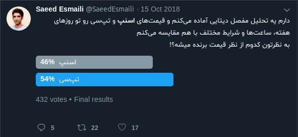
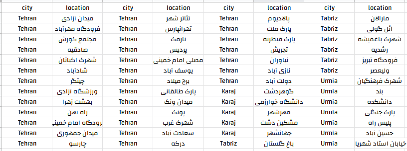
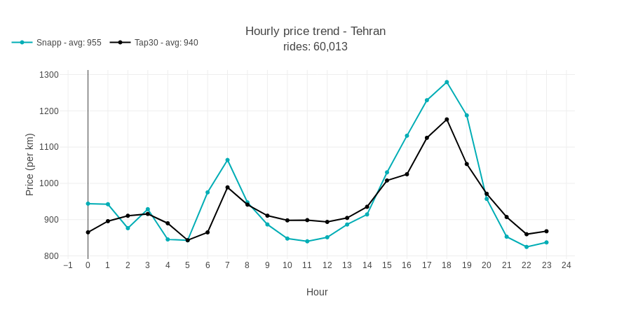
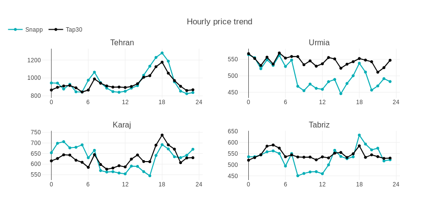
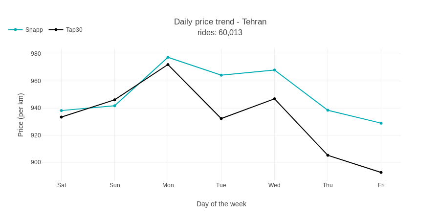
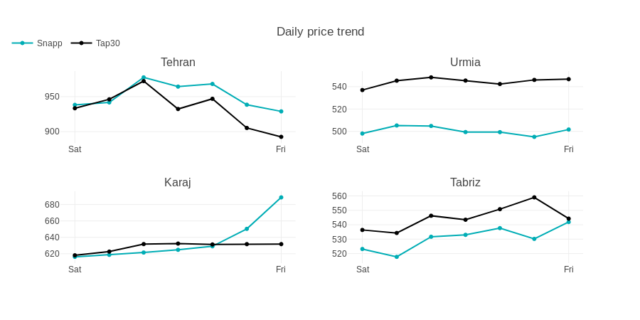
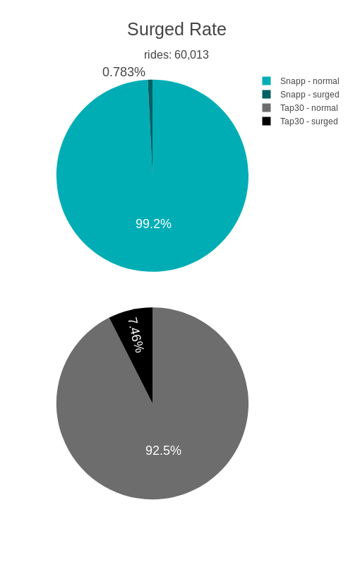
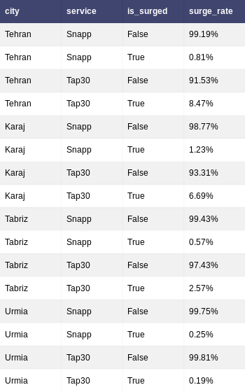
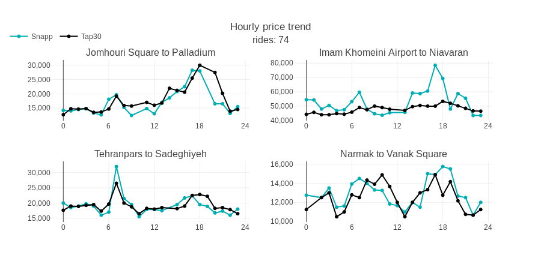

احتمالا واسه شما هم پیش اومده که موقع درخواست آنلاین تاکسی، مسیر رو روی هر دو اپ اسنپ و تپ‌سی انتخاب کردید تا قیمتشون رو مقایسه کنید و خیلی وقت‌‌ها قیمتشون تفاوت زیادی با هم داشته‌اند. اوایل پاییز بود که کنجکاو شدم راجع به تفاوت قیمت این دو سرویس تاکسی آنلاین تحقیق کنم. همون موقع [توی توییتر پرسیدم](https://twitter.com/SaeedEsmaili/status/1051877324872921088) تا ببینم تجربه کاربرا کدوم سرویس رو ارزون‌تر نشون میده:  



و یه اسکریپتی نوشتم تا یه مدت فعال باشه و قیمت اسنپ و تپ‌سی رو در شرایط مختلف دربیاره و ذخیره کنه. نحوه کار این اسکریپت این‌طور بود که دو نقطه جغرافیایی از مکان‌های منتخبی که بهش داده بودم رو انتخاب می‌کرد و همزمان از اسنپ و تپ‌سی قیمت سفر بین این مبدا و مقصد رو می‌پرسید. برای این‌که شرایط مختلف رو در نظر گرفته باشم، این نکات رو اعمال کردم:  

- اسکریپت رو برای مدت زمان نسبتا طولانی (حدود ۴ ماه) فعال نگه‌داشتم تا تعداد قابل قبولی از روزهای غیرعادی مثل تعطیل رسمی، بارونی و برفی رو شامل بشه. بعضی از روزهای این بازه، اسکریپت غیرفعال بود، اما با توجه به بزرگی دیتای جمع‌آوری شده، مشکلی توی تحلیل نهایی به‌وجود نمیاره.
- لوکیشن‌های منتخب مبدا و مقصد رو از نقاط مختلف سطح شهر تهران انتخاب کردم. علاوه بر تهران، نقاطی از شهرهای اورمیه، تبریز و کرج رو هم اضافه کردم. (اسکریپت حواسش بود که مبدا و مقصد حتما از یه شهر باشن)



لوکیشن‌های منتخب

<table class="wp-block-table"><tbody><tr><td>شهرها</td><td>تهران، کرج، تبریز، اورمیه</td></tr><tr><td>تعداد دفعات درخواست قیمت از اسنپ و تپ‌سی</td><td>۷۴۵۵۰ بار</td></tr><tr><td>اولین درخواست قیمت</td><td>۲۴ مهر</td></tr><tr><td>آخرین درخواست قیمت</td><td>۳ بهمن</td></tr></tbody></table>

از اونجایی که نمی‌شد در لحظه برای همه مبدا و مقصدهای منتخب درخواست قیمت کرد (مثلا برای تهران، می‌شد ۱۰۳۶ حالت مختلف!)، قیمت‌ها به صورت رندوم برای بعضی از لوکیشن‌ها درخواست می‌شد. بنابراین یه میانگین ساده از قیمت‌هایی که اسنپ و تپ‌سی برگردوندن، کمکی نمی‌کنه. برای این‌که قیمت‌ها رو مستقل از مبدا و مقصد بکنم، از [API مسیریاب نشان](https://developers.neshan.org/) استفاده کردم و مسافت بین مبدا و مقصد رو هم به دیتا اضافه کردم؛ پس می‌تونیم یه متریک جدید داشته باشیم: قیمت به ازای هر کیلومتر مسافت. اکثر تحلیل‌ها رو براساس این متریک انجام میدیم تا ببینیم اسنپ و تپ‌سی، برای هر کیلومتر از سفرها، به طور میانگین چند تومان از کاربراشون درخواست می‌کنن.

دیتاست اصلی رو بعد از یه سری تمیزکاری، روی [گیت‌هاب](https://github.com/saeedesmaili/snapp-tap30-price-comparison) گذاشتم و می‌تونید استفاده کنید. (شاید این قسمت تمیزکاری رو به همراه دیتاست اصلی، تو یه پست دیگه راجع بهش حرف زدیم بعدا)

```python
import pandas as pd

df = pd.read_csv('rides.csv')

# Hourly
df_tehran = df.copy()[df.city == "Tehran"]
df_tehran['timestamp'] = pd.to_datetime(df_tehran['timestamp'])
df_tehran_g = df_tehran.groupby([df_tehran.timestamp.dt.hour, df_tehran.service], as_index=True).agg({
    'price_per_km': 'mean'
})
df_tehran_g.reset_index(inplace=True)  

df_snapp = df_tehran_g[df_tehran_g.service == "Snapp"][['timestamp', 'price_per_km']]
df_snapp.columns = ['timestamp', 'snapp_price']
df_tap30 = df_tehran_g[df_tehran_g.service == "Tap30"][['timestamp', 'price_per_km']]
df_tap30.columns = ['timestamp', 'tap30_price']

df_tehran_g = pd.merge(df_snapp, df_tap30)
```
برای ساختن چارت، از لایبرری [plotly](https://plot.ly/python/) استفاده خواهیم کرد:

```python
snapp_mean = df_tehran[df_tehran.service == "Snapp"].price_per_km.mean()
tap30_mean = df_tehran[df_tehran.service == "Tap30"].price_per_km.mean()

trace1 = go.Scatter(
    x = df_tehran_g.timestamp,
    y = df_tehran_g.snapp_price,
    mode = 'lines+markers',
    name = 'Snapp - avg: {0:.0f}'.format(round(snapp_mean,0)),
    line = dict(
        color = ('#00ADB5'),
        width = 2)
)
trace2 = go.Scatter(
    x = df_tehran_g.timestamp,
    y = df_tehran_g.tap30_price,
    mode = 'lines+markers',
    name = 'Tap30 - avg: {0:.0f}'.format(round(tap30_mean,0)),
    line = dict(
        color = ('#000000'),
        width = 2)
)

data = [trace1, trace2]

layout = dict(title = 'Hourly price trend - Tehran<br><span style="font-size: 1.5rem">rides: {:,.0f}</span>'.format(df_tehran.timestamp.count()/2),
              xaxis = dict(title = 'Hour', showticklabels=True, dtick=1),
              yaxis = dict(title = 'Price (per km)'),
              legend=dict(orientation="h", x=-.1, y=1.2)
              )
fig = dict(data=data, layout=layout)
iplot(fig)
```


این‌طور به نظر میاد که تو ساعت‌های اوج درخواست صبح و عصر، قیمت اسنپ بیشتره، ولی دقت کنید که اختلافشون اون‌قدرها هم زیاد نیست. میانگین قیمت اسنپ برای هر کیلومتر مسافت، ۹۵۵ تومان و میانگین قیمت تپ‌سی ۹۴۰ تومانه. اگه مصرانه بخوایم دنبال یه برنده باشیم، تپ‌سی قیمتش پایین‌تره، ولی با اختلاف خیلی خیلی کم.

اگه همین آنالیز رو برای شهرهای دیگه هم داشته باشیم:



کاملا مشخصه که قیمت اسنپ تو این شهرها از تپ‌سی بهتره؛ توی اورمیه که برنده مطلق اسنپه.

ببینیم قیمت‌ها تو روزهای مختلف هفته چطور تغییر می‌کنن:

```python
# weekday
df_tehran = df.copy()[df.city == "Tehran"]
df_tehran['timestamp'] = pd.to_datetime(df_tehran['timestamp'])
df_tehran_g = df_tehran.groupby([df_tehran.timestamp.dt.weekday, df_tehran.service], as_index=True).agg({
    'price_per_km': 'mean'
})
df_tehran_g.reset_index(inplace=True)  

df_snapp = df_tehran_g[df_tehran_g.service == "Snapp"][['timestamp', 'price_per_km']]
df_snapp.columns = ['timestamp', 'snapp_price']
df_tap30 = df_tehran_g[df_tehran_g.service == "Tap30"][['timestamp', 'price_per_km']]
df_tap30.columns = ['timestamp', 'tap30_price']

df_tehran_g = pd.merge(df_snapp, df_tap30)

sorter = [5, 6, 0, 1, 2, 3, 4]
sorterIndex = dict(zip(sorter,range(len(sorter))))
df_tehran_g['rank'] = df_tehran_g['timestamp'].map(sorterIndex)
df_tehran_g.sort_values(by='rank', inplace=True)
df_tehran_g.timestamp = ['Sat', 'Sun', 'Mon', 'Tue', 'Wed', 'Thu', 'Fri']

trace1 = go.Scatter(
    x = df_tehran_g.timestamp,
    y = df_tehran_g.snapp_price,
    mode = 'lines+markers',
    name = 'Snapp',
    line = dict(
        color = ('#00ADB5'),
        width = 2)
)
trace2 = go.Scatter(
    x = df_tehran_g.timestamp,
    y = df_tehran_g.tap30_price,
    mode = 'lines+markers',
    name = 'Tap30',
    line = dict(
        color = ('#000000'),
        width = 2)
)

data = [trace1, trace2]

layout = dict(title = 'Daily price trend - Tehran<br><span style="font-size: 1rem">rides: {:,.0f}</span>'.format(df_tehran.timestamp.count()/2),
              xaxis = dict(title = 'Day of the week', showticklabels=True, dtick=1,),
              yaxis = dict(title = 'Price (per km)'),
              legend=dict(orientation="h", x=-.1, y=1.2),
              width = 900
              )
fig = dict(data=data, layout=layout)
iplot(fig)
```


همون طور که انتظار میره، قیمت‌ها تو روزهای پنجشنبه و جمعه پایین‌تره، دوشنبه هم احتمالا پرترافیک‌ترین روز هفته توی تهرانه (که قبلا هم [برام سوال بوده](https://twitter.com/SaeedEsmaili/status/1059466324546670598) که دلیلش چیه). اسنپ و تپ‌سی قیمت‌هاشون روزهای شنبه، یکشنبه و دوشنبه خیلی به هم نزدیکه، و بقیه روزها هم با اختلاف خیلی کمی تپ‌سی ارزون‌تره.

ببینیم وضعیتشون توی بقیه شهرها چطوره:



اسنپ چرا آخر هفته‌ها توی کرج قیمتش بالا میره؟ مورد جالبی برای بررسی کردن به نظر می‌رسه (که فعلا می‌ذارم همین‌جوری بمونه، شاید بعدا بررسی کردیم).

یه چیزی که موقع استفاده از اسنپ و تپ‌سی می‌بینیم، افزایش قیمت‌هاشون هست که معمولا تو شرایط خاص آب‌وهوایی یا وقتی قبول‌کننده درخواست‌ها کم هستن اتفاق می‌افته. شخصا به تجربه زیاد دیده بودم که تپ‌سی خیلی بیشتر از اسنپ، «اوج درخواست» نشون میده و قیمت رو بالا می‌بره. آیا دیتا هم این فرضیه من رو تایید می‌کنه؟

```python
## surged:
df_surged = df.groupby(['city', 'is_surged', 'service'], as_index=False).count()[['city', 'service', 'is_surged', 'counts']]

sorter = ["Tehran", "Karaj", "Tabriz", "Urmia"]
sorterIndex = dict(zip(sorter,range(len(sorter))))
df_surged['rank'] = df_surged['city'].map(sorterIndex)
df_surged.sort_values(by=['rank', 'service'], inplace=True)
del df_surged['rank']

df_g2 = df_surged.groupby(['city', 'service'], as_index=False).sum()[['city', 'service', 'counts']]
df_merge = pd.merge(df_surged, df_g2, on=['city', 'service'],how='left')
df_merge['surge_rate'] = df_merge.counts_x / df_merge.counts_y

del df_merge['counts_x']
del df_merge['counts_y']

df_merge['surge_rate'] = pd.Series(["{0:.2f}%".format(val * 100) for val in df_merge['surge_rate']], index = df_merge.index)

df_surged_g = df_surged.groupby(['service', 'is_surged'], as_index=False).sum()
df_surged_g['label'] = ['Snapp - normal', 'Snapp - surged', 'Tap30 - normal', 'Tap30 - surged']

fig = {
    'data': [
        {
            'labels': df_surged_g[df_surged_g.service == "Snapp"].label.tolist(),
            'values': df_surged_g[df_surged_g.service == "Snapp"].counts.tolist(),
            'marker': {'colors': ['#00ADB5',
                                  '#006064',
                                 ]},
            'type': 'pie',
            'name': 'Sunflowers',
            'domain': {'y': [.52, 1],
                       'x': [0, 1]},
            'hoverinfo':'label+percent+name',

        },
        {
            'labels': df_surged_g[df_surged_g.service == "Tap30"].label.tolist(),
            'values': df_surged_g[df_surged_g.service == "Tap30"].counts.tolist(),
            'type': 'pie',
            'name': 'Starry Night',
            'marker': {'colors': ['#6d6d6d',
                                  '#000000',
                                  ]},
            'domain': {'y': [0, .48],
                       'x': [0, 1]},
            'hoverinfo':'label+percent+name',
        },
        
    ],
    'layout': {'title': 'Surged Rate<br><span style="font-size: 1rem">rides: {:,.0f}</span>'.format(df_tehran.timestamp.count()/2),
              'font': {'size': 18},
              'legend': {'font': {'size': 12}},
               'width': 500,
               'height': 800
              }
}

iplot(fig, filename='pie_chart_subplots')
```




بله، تپ‌سی ۹.۵ برابر بیشتر از اسنپ روی وضعیت «اوج درخواست» میره. درسته که تعریفش برای این سرویس‌ها حتما فرق می‌کنه، ولی به هر حال من کاربر موقع استفاده از تپ‌سی، ۹.۵ برابر بیشتر از زمان استفاده از اسنپ، پیام «اوج درخواست» رو می‌بینم و حس می‌کنم قیمت بیشتری باید پرداخت کنم. شاید هم تعداد ماشین‌های تپ‌سی در مقایسه با اسنپ کم‌تره؛ دیتاش رو که نداریم چک کنیم.

بیاید چهار مسیر رو تصادفا از دیتاست انتخاب کنیم و قیمت سفر تو این مسیرها رو برای اسنپ و تپ‌سی مقایسه کنیم. مسیرهایی که من (مثلا) تصادفی انتخاب کردم، این‌ها هستن:

- میدان جمهوری به پالادیوم
- فرودگاه امام خمینی به نیاوران
- تهران‌پارس به صادقیه
- نارمک به میدان ونک



تحلیل این آخری رو هم به خودتون واگذار می‌کنم. دیتای کامل هم که روی [گیت‌هاب](https://github.com/saeedesmaili/snapp-tap30-price-comparison) هست و می‌تونید ازش استفاده کنید.

چه کارهای دیگه‌ای می‌تونستیم بکنیم؟

- قیمت‌های اسنپ‌بایک و تپ‌سی‌لاین رو هم کنار سفرهای کلاسیکی که بررسی کردیم بیاریم (دیتاش رو توی دیتاست خام داریم).
- چک کنیم ببینیم چه روزهایی تو این بازه ۴ ماهه بارونی بوده (یا تو اورمیه و تبریز برفی بوده) و چه تاثیری روی قیمت اسنپ و تپ‌سی داشته.

به نظر شما دیگه چه کارهایی میشه با این دیتا کرد؟
